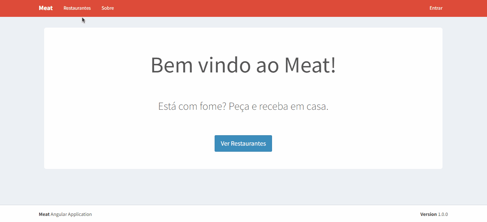

  <a href="#-tecnologias">Tecnologias</a>&nbsp;&nbsp;&nbsp;|&nbsp;&nbsp;&nbsp;
  <a href="#-projeto">Projeto</a>&nbsp;&nbsp;&nbsp;|&nbsp;&nbsp;&nbsp;
  <a href="#-licença">Licença</a>&nbsp;&nbsp;&nbsp;|&nbsp;&nbsp;&nbsp;
  <a href="#-getting-started">Getting Started</a>

 

  

 

  

## 🚀 Tecnologias

Esse projeto foi desenvolvido com as seguintes tecnologias:

- Angular
- TypeScript
- Bootstrap

Bibliotecas

- [Google Fonts](https://fonts.google.com/)
- [Icomoon](https://icomoon.io/)

## 💻 Projeto

Aplicação de delivery de comida desenvolvida com Angular. Possui autenticação via email e senha com validadores na API da aplicação.

## 📝 Licença

Esse projeto está sob a licença MIT. Veja o arquivo [LICENSE](.github/LICENSE.md) para mais detalhes.

## ▶ Getting Started

### Inicializando o Servidor

`ng serve` ou `npm start`

### Instalando o json-server

`npm install -g json-server`

### Iniciando o serviço (raiz da aplicação)

`json-server db.json`
